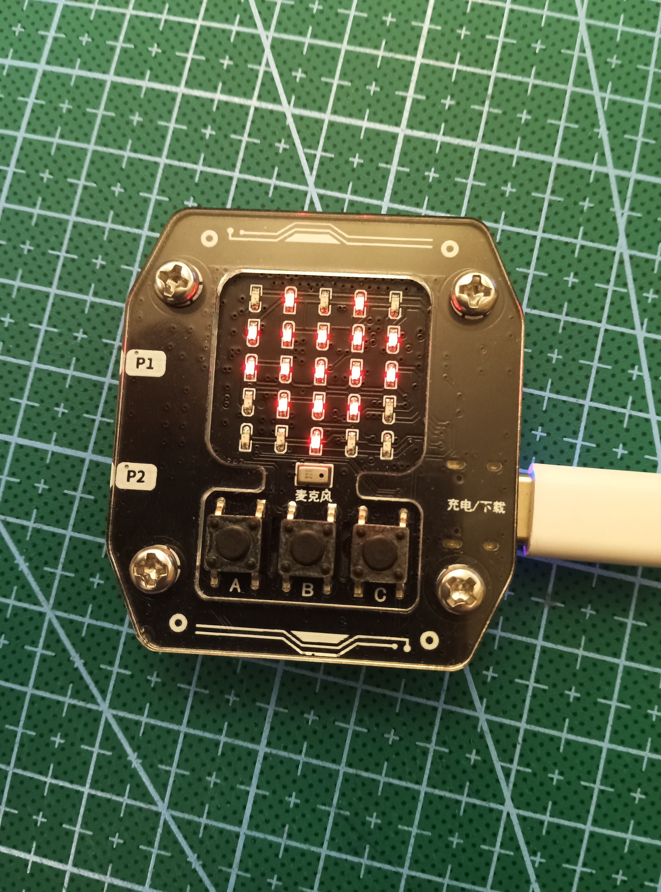

# Sparkling Heart Example

This is a simple example of how to use the alphapi LED in your own projects.

## Controlling the LED

The alphapi LED is a simple LED that can be controlled by UART.
GPIO: TX: 8, RX: 9

## Functions

The alphapi LED has the following functions:
    1. alphapi_display_init() - Initialize the LED
    2. led_show_matrix() - Display a matrix

## Example

In this project example, the achieved effect is as follows:

